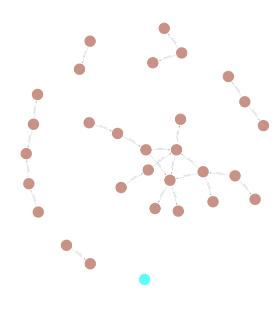

# 🕸️ Agentic Knowledge Graph System: Nova Tech Solutions

[](https://www.python.org/downloads/release/python-3110/)
[](https://neo4j.com/cloud/aura/)
[](https://langchain.com/)
[](https://streamlit.io/)

A deeply sophisticated, asynchronous, strictly-typed Agentic AI system that builds and queries a Neo4j Knowledge Graph based on remote enterprise documents. Built around modern 2026 Software Engineering best practices for AI development.


## 🏗️ Architecture & Pro Best Practices

This project diverges from "script-like" LLM applications and enforces strict software engineering principles:

1. **Strict Type Validation via Pydantic:** Every LLM response is forced through LangChain's `.with_structured_output()` and parsed perfectly into `BaseModel` schemas. No regex hacking.
2. **True Asynchronous Execution:** The entire Agent network and ingest pipeline leverages `async/await` and thread-offloading via `asyncio.to_thread` to ensure parallel, non-blocking operation capable of high throughput.
3. **Idempotent Remote Ingestion:** Facts are autonomously ingested from a GitHub repository via standard REST APIs.
   - **State Tracking:** Document hashes are maintained in Neo4j to ignore unchanged files.
   - **Soft-Deletes:** Updates are gracefully handled by invalidating (`valid = false`) outdated relationships rather than performing destructive deletes, preserving history.
4. **Defensive Programming:** A custom `@async_retry_with_fallback` decorator wraps unreliable network/LLM calls with exponential backoffs to conquer rate limits seamlessly.
5. **Functional Composition:** Zero "Mega Classes". Prompts live safely in `src/prompts/prompts.yaml`, logic sits in isolated functional tools (`src/agents/`), and components assemble cleanly.

## 📊 The Knowledge Graph

The graph represents the internal structure, tooling, reporting chains, and team dynamics of **Nova Tech Solutions**, a 35-person remote B2B SaaS company.



### Underlying Data Representation (Neo4j Extract)
```json
[
  {
    "n": { "labels": ["Entity"], "properties": {"name": "Priya Nair"} },
    "r": { "type": "mentors", "properties": {"source_uri": "...", "valid": true} },
    "m": { "labels": ["Entity"], "properties": {"name": "Carlos Mendez"} }
  },
  {
    "n": { "labels": ["Entity"], "properties": {"name": "Engineering Team"} },
    "r": { "type": "is_responsible_for", "properties": {"source_uri": "...", "valid": true} },
    "m": { "labels": ["Entity"], "properties": {"name": "backend development"} }
  }
]
```

## 🛠️ Usage

**1. Configure the pipeline:**
Set your LLM configuration and GitHub remote repository inside `config/config.yaml`. Fill your `.env` with `NEO4J_URI`, `NEO4J_USERNAME`, `NEO4J_PASSWORD`, and `GEMINI_API_KEY`.

**2. Synchronize the Graph (Remote Ingestion):**
```bash
python run_ingest.py
```
This will compute file hashes from GitHub, invalidate outdated triples, extract new schemas, and upsert the Neo4j Graph.

**3. Run the Interface:**
```bash
streamlit run app.py
```
Interact seamlessly in real-time with your data!
